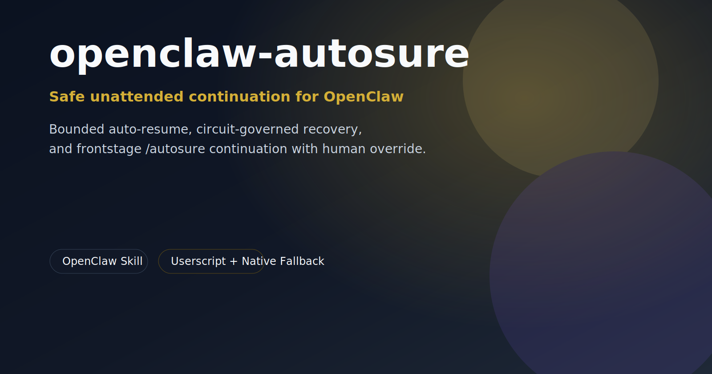
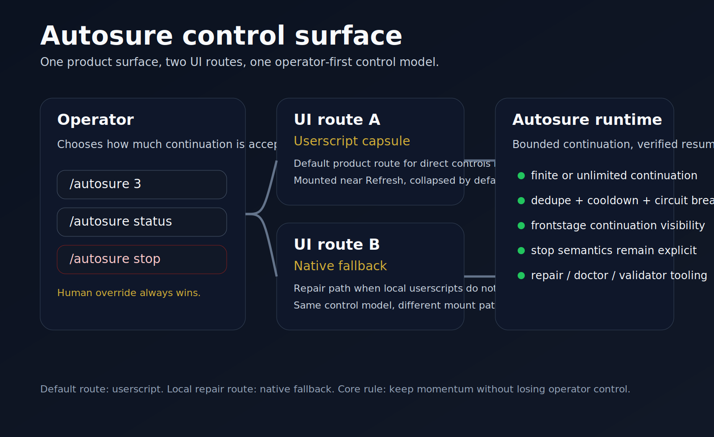
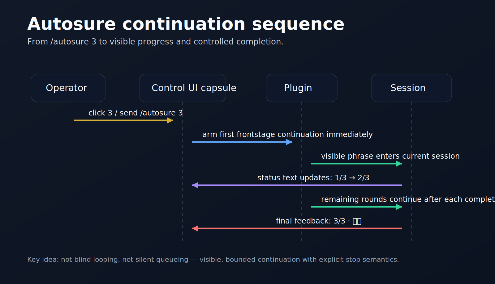
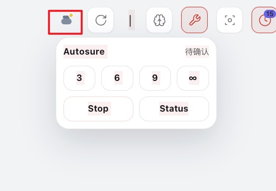

# openclaw-autosure

**English** | [中文](./README.zh-CN.md)

**Safe unattended continuation for OpenClaw.**

`openclaw-autosure` is a self-contained OpenClaw skill for operators who want long-running sessions to keep moving **without turning into blind retry spam**.

It combines:

- **failure-aware auto-resume** with circuit breaker and dedupe
- **bounded or unlimited `/autosure` continuation loops**
- **human override by default**
- **optional UI capsule** for direct controls
- **native fallback** when local userscript execution is unreliable

## 20-second product trailer

A short promo cut that shows the intended product emotion more clearly: **momentum preserved, human still in control, premium positive tech tone**.

> Click the poster above to open the MP4 directly on GitHub.

## At a glance

## Real interface example

A real screenshot from local OpenClaw Control UI showing the Autosure capsule mounted near Refresh.

## Why it exists

Most unattended agent setups fail in one of two ugly ways:

1. they stop too easily and need constant human nudging
2. they resume too aggressively and create message storms or drift

Autosure is designed to sit in the middle: keep momentum, keep boundaries, keep the human in charge.

## Core capabilities

- **Bounded success-loop control**
  - `/autosure N` for finite continuation rounds
  - `/autosure` for unlimited continuation until stopped or interrupted by a human message

- **Failure-safe resume**
  - resumes only on verified interruption paths
  - dedupe + cooldown + circuit breaker included

- **Frontstage continuation UX**
  - current versions support more visible continuation behavior in OpenClaw Control UI
  - optional userscript UI capsule with native fallback repair path

- **Operator tooling**
  - install scripts
  - repair/doctor tools
  - runtime validators
  - deployment and handoff docs

## What makes it different

Unlike generic “keep going” hacks, Autosure is built around **bounded continuation** and **operator safety**:

- it does **not** assume infinite retries are acceptable
- it does **not** hide the stop path
- it does **not** depend on one fragile UI layer
- it treats recovery, visibility, and control as one product surface

## Scope and boundaries

Autosure is for **OpenClaw operators**.

It is not:
- a generic browser extension
- a universal agent runner
- a replacement for human supervision on risky tasks

Default product route:
- **userscript UI capsule**

Practical local exception:
- on machines where userscripts do not execute reliably on local OpenClaw Control UI, the **native fallback patch** is the intended repair route

## Install

### Option A — packaged release
Use the packaged artifact in:

- [`dist/autosure.skill`](./dist/autosure.skill)

### Option B — source install
Copy [`skill/autosure/`](./skill/autosure/) into your OpenClaw workspace, then follow:

- [`skill/autosure/DEPLOY.md`](./skill/autosure/DEPLOY.md)
- [`skill/autosure/HANDOFF_FOR_AGENT.md`](./skill/autosure/HANDOFF_FOR_AGENT.md)

## Example prompts / commands

- `/autosure`
- `/autosure 3`
- `/autosure 9`
- `/autosure status`
- `/autosure stop`

Typical use case:

> Run this task with autosure, keep going for 3 more rounds unless I interrupt.

## Repository layout

- `dist/` — packaged `.skill` artifact
- `skill/autosure/` — source skill
- `releases/` — release notes
- `assets/` — public repo assets

## Version posture

This repository is being published as:

- **v0.1.0** — first public useful release

The implementation is already field-tested, but the public repo surface is intentionally conservative for the first release.

## Release links

- Release notes: [`releases/v0.1.0.md`](./releases/v0.1.0.md)
- Packaged artifact: [`dist/autosure.skill`](./dist/autosure.skill)
