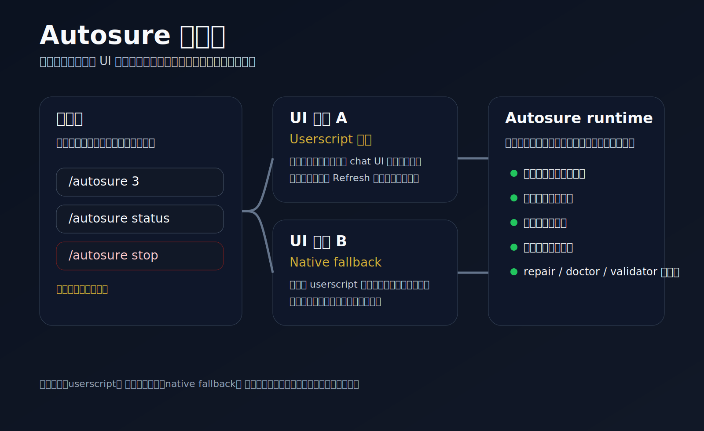
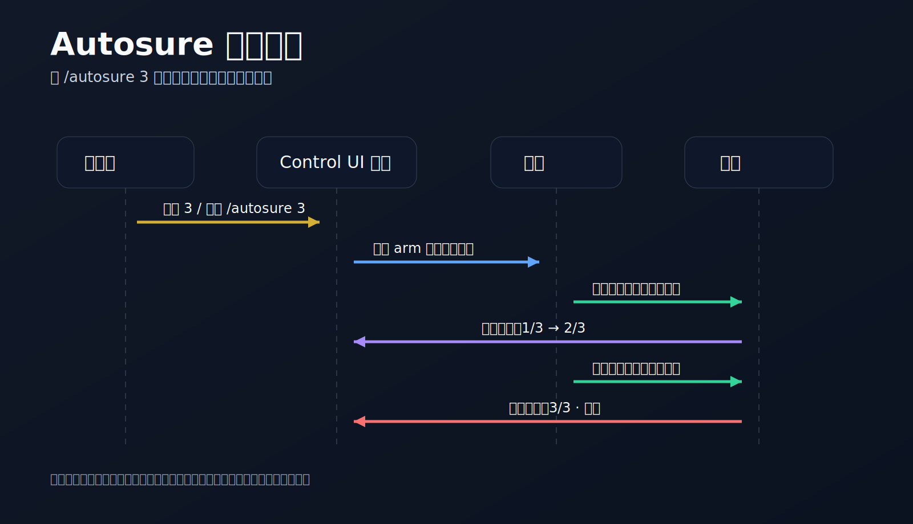
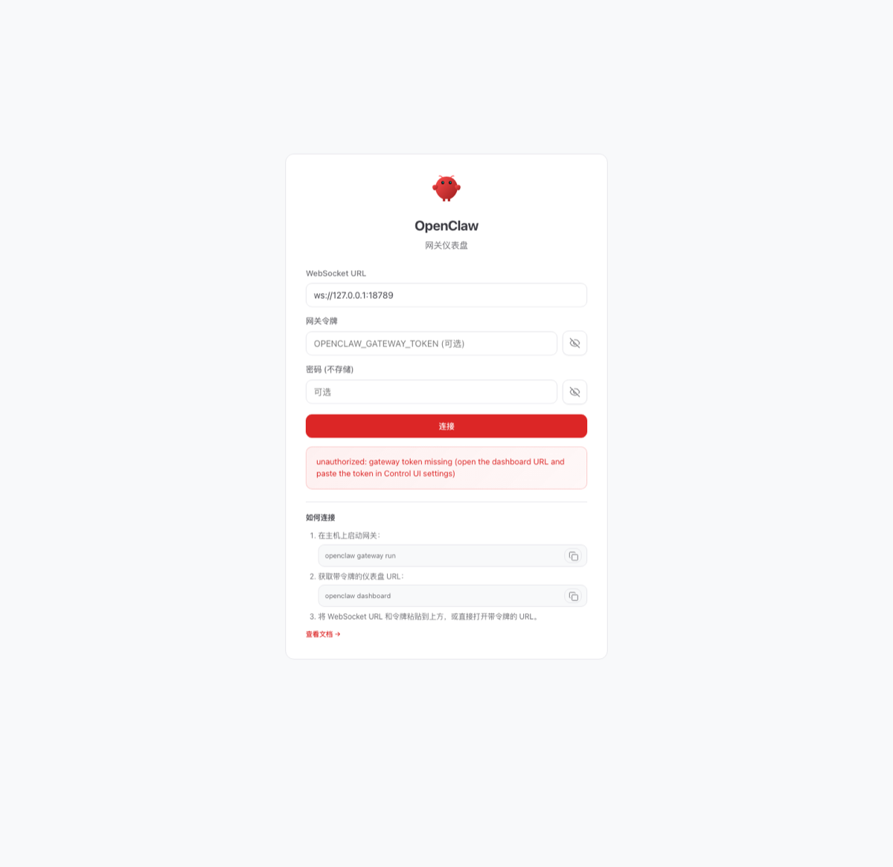

# openclaw-autosure

[English](./README.md) | **中文**

**给 OpenClaw 用的安全型无人值守续跑 skill。**

`openclaw-autosure` 是一个面向 OpenClaw 操作者的独立 skill，目标不是“让它无限自己跑”，而是让长任务在**不失控**的前提下持续推进。

它把几件事放在了一起：

- **基于真实失败信号的自动续跑**
- **有边界或不限轮次的 `/autosure` 连续推进**
- **人工随时打断接管**
- **可选 UI 胶囊**
- **当 userscript 在本机失效时的 native fallback 修复路径**

## 一眼看懂

## 真实界面示例

这是一张来自本地 OpenClaw Control UI debug 模式（`autosureDebug=1`）的真实界面截图。

## 为什么会有它

很多无人值守方案最后都会翻车在两个方向：

1. 太脆，一停就得人手动接着推
2. 太莽，一出错就开始盲目重试和刷屏

Autosure 的目标不是极端自动化，而是：

- 保持推进
- 保持边界
- 保持人类优先

## 核心能力

- **有边界的成功连轮控制**
  - `/autosure N`：有限轮次继续
  - `/autosure`：不限轮次，直到你停止或用普通消息接管

- **失败安全续跑**
  - 只在经过验证的中断路径上恢复
  - 自带去重、冷却、熔断

- **前台续跑体验**
  - 当前版本加强了 OpenClaw Control UI 中的可见性与反馈
  - 提供可选 userscript UI 胶囊，并保留 native fallback 修复路径

- **运维工具链**
  - 安装脚本
  - repair / doctor 工具
  - runtime validator
  - 部署与 handoff 文档

## 它和一般“继续跑”脚本的区别

Autosure 不是一句“继续”魔法咒语的包装壳。

它更强调：

- **续跑必须有边界**
- **恢复必须有判断**
- **停止路径必须清晰**
- **不能把所有信任压在单一 UI 层上**

换句话说，它更像一个给真实操作者用的 OpenClaw 续跑产品面，而不是临时技巧集合。

## 范围与边界

Autosure 面向的是 **OpenClaw 操作者**。

它不是：
- 通用浏览器插件
- 万能 Agent 调度器
- 可以替代人类判断的风险任务自动驾驶

默认产品路线：
- **userscript UI capsule**

现实例外：
- 如果某台机器的本地 OpenClaw Control UI 上 userscript 执行不可靠，就应使用 **native fallback** 作为修复路线

## 安装

### 方案 A：直接使用打包产物
使用：

- [`dist/autosure.skill`](./dist/autosure.skill)

### 方案 B：使用源码安装
把 [`skill/autosure/`](./skill/autosure/) 放进 OpenClaw workspace，再按以下文档安装：

- [`skill/autosure/DEPLOY.md`](./skill/autosure/DEPLOY.md)
- [`skill/autosure/HANDOFF_FOR_AGENT.md`](./skill/autosure/HANDOFF_FOR_AGENT.md)

## 常用命令

- `/autosure`
- `/autosure 3`
- `/autosure 9`
- `/autosure status`
- `/autosure stop`

典型使用语气：

> 用 autosure 再推进 3 轮，除非我中途打断。

## 仓库结构

- `dist/` — 打包好的 `.skill`
- `skill/autosure/` — skill 源码
- `releases/` — release 说明
- `assets/` — 仓库公开资产

## 版本姿态

当前公开版本：

- **v0.1.0** — 首个公开可用版本

实现本身已经经过实际使用和工程收口，但公开仓库表面在首发时保持克制，不假装自己已经是超级大而全的框架。

## 发布链接

- 发布说明：[`releases/v0.1.0.md`](./releases/v0.1.0.md)
- 安装包：[`dist/autosure.skill`](./dist/autosure.skill)
